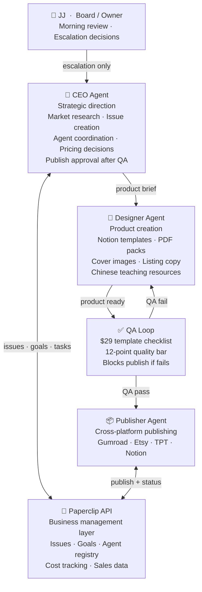
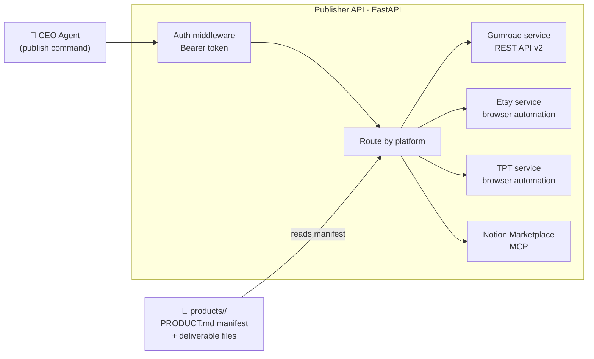

# avery-studio

> An autonomous overnight digital product factory. Agents research, create, and publish while you sleep.

Avery Studio is a multi-agent system that runs an autonomous digital product business. Every night, a team of AI agents researches market gaps, creates Notion templates and prompt packs, writes listings, and publishes across four platforms — with no human in the loop until the morning report lands.

---

## Agent team

---

## Overnight pipeline

Every night from 11PM to 5AM ET, the factory runs autonomously:

```mermaid
gantt
    title Overnight Factory  ·  11PM – 5AM ET
    dateFormat HH:mm
    axisFormat %H:%M

    section Research
    Market scan · gap analysis · competitor pricing  :11:00, 60m

    section Create
    Notion templates (MCP)                           :00:00, 60m
    PDF products · prompt packs · planners           :01:00, 60m
    Visual products · Canva exports                  :02:00, 60m
    Chinese teaching resources                       :03:00, 60m

    section Ship
    Generate listings + QA check                     :04:00, 60m
    Write morning report → queue/nightly-report.md   :05:00, 30m
```

---

## Publisher API

A FastAPI service that abstracts publishing across four marketplaces. Each platform has its own route — Gumroad via REST API, Etsy and TPT via browser automation.

---

## Product quality bar

Nothing ships without passing the **$29 template checklist**. 12 required elements including:

| Requirement | Why |
|---|---|
| Multiple interconnected databases with relations | Demonstrates real Notion expertise |
| Pre-built views: Table + Board + Calendar + Gallery | Immediate usability out of the box |
| Rich sample data that tells a story | Lets buyers evaluate fit before buying |
| Dashboard page with embedded views + metrics | The "wow" moment that justifies the price |
| Step-by-step onboarding guide | Reduces support tickets, increases reviews |
| Custom cover image (brand-matched) | First impression in marketplace search |

The QA loop blocks publishing if any of the 12 checks fail. The Designer agent revises until it passes.

---

## Platform reach

| Platform | Product type | Audience |
|---|---|---|
| Notion Marketplace | Notion templates | Notion power users |
| Gumroad | Templates · prompt packs · planners | Indie creators |
| Etsy | Digital downloads | Small business owners |
| Teachers Pay Teachers | Chinese teaching resources | K-12 educators |

---

## Tech stack

---

Built by [Joy Dong](https://www.joydong.org) · [ownlyagent.com](https://ownlyagent.com)